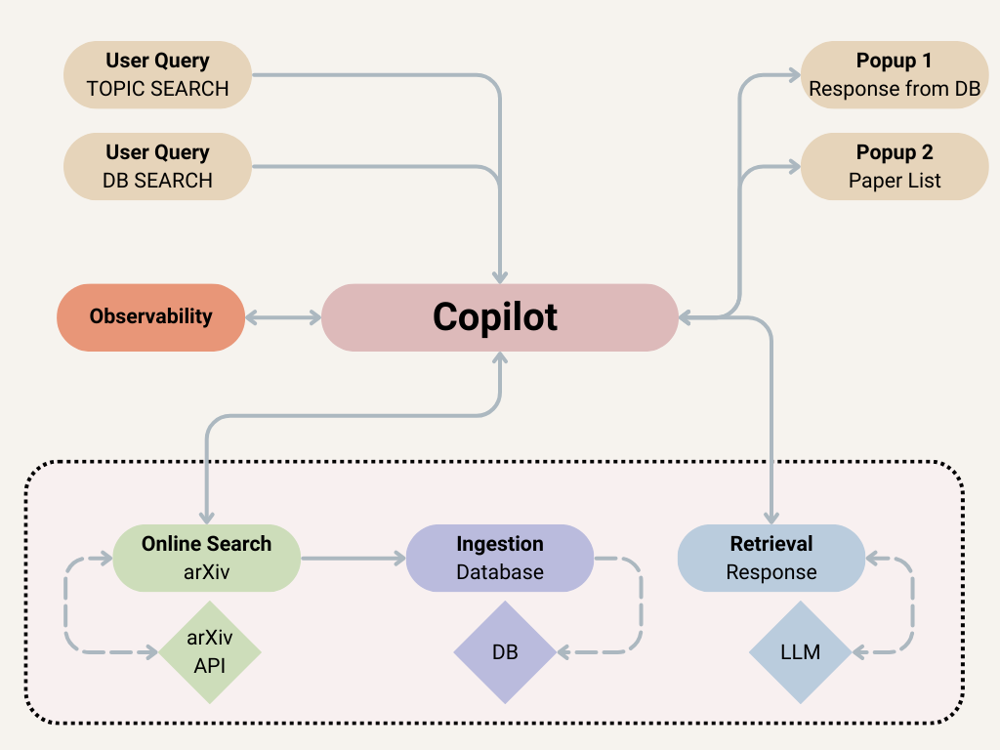
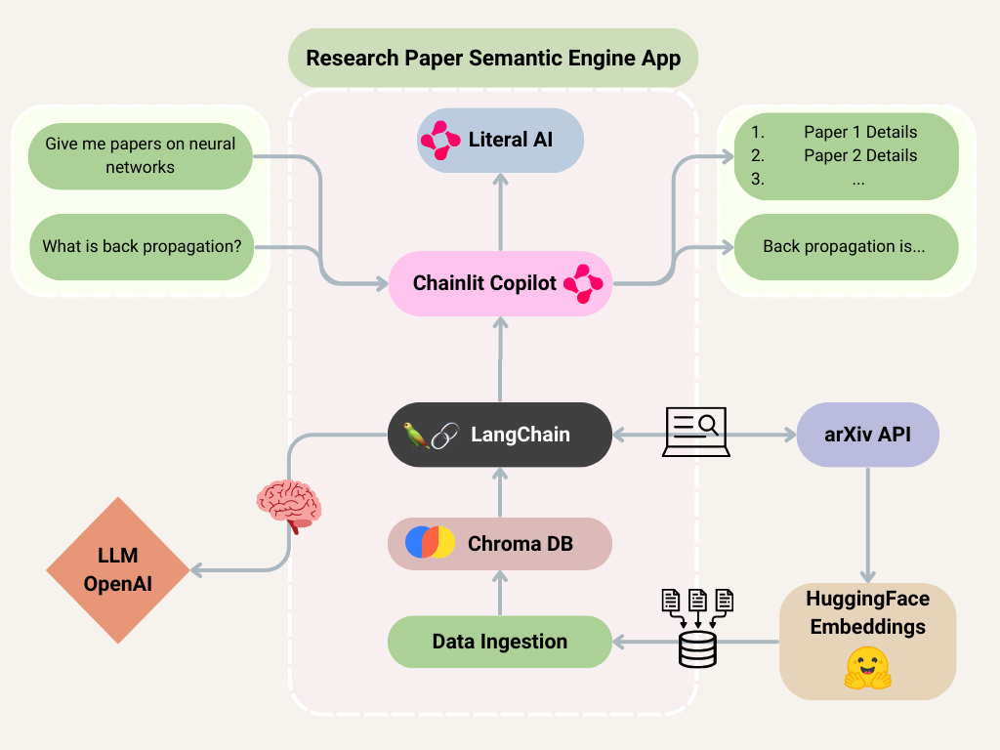

# Observable Semantic Research Paper Engine with Chainlit Copilot, Literal and LangChain

This project demonstrated how to create an observable research paper engine using the arXiv API to retrieve the most similar papers to a user query. The retrieved papers are embedded into a Chroma vector database, based on Retrieval Augmented Generation (RAG). The user can then ask questions from the retrieved papers. The application embeds a Chainlit based Copilot inside the webpage, allowing for a more interactive and friendly user experience. To track performance and observe the application's behavior, the application is integrated with Literal AI, an observability framework. 

## Copilot
Software Copilot are a new kind of assistant embedded in your app/product. They are designed to help users get the most out of your app by providing contextual guidance and take actions on their behalf. Here is an overview of the application architecture:




## Key Features

- Retrieve relevant papers based on user query using the LangChain wrapper for `arXiv` API
- Embed retrieved papers in a Chroma database to initiate a RAG pipeline
- Create optimized prompts for the RAG pipeline using Literal
- Develop a Chainlit application for the above
- Create a simple web for the application
- Embed the Chainlit Copilot inside the web app for a more interactive experience
- Integrate observability features to track app performance and generations using Literal

## Tech Stack

This project leverages the following technologies:

- [Chainlit](https://github.com/Chainlit/chainlit): Used for deploying a frontend application for the chatbot, and embedding the copilot.
- [Literal](https://docs.getliteral.ai/get-started/overview): For creating, optimizing and testing prompts for the RAG pipeline, and for integrating observability features in the app.
- [LangChain](https://github.com/langchain-ai/langchain): For retrieving arXiv queries, and managing the app's language understanding and generation.
- [OpenAI](https://openai.com/): Ensures high-speed computations utilizing the GPT-3.5 models.
- [Chroma](https://github.com/chroma-core/chroma): For creating the vector store to be used  in retrieval.

## Prerequisites

- Python 3.8 or later
- An OpenAI API key
- A Literal AI API Key

## Clone the Repository
Clone this repo using the following commands:
```
bash
git clone git@github.com:tahreemrasul/semantic_research_engine.git
cd ./semantic_research_engine
```

## Environment Setup

### Conda Environment

To set up your development environment, you'll need to install Conda. Once Conda is installed, you can create and activate a new environment with the following commands:

```bash
conda create --name semantic_research_engine python=3.10
conda activate semantic_research_engine
```
## Dependencies Installation
After activating the Conda environment, install the project dependencies by running:

```bash
pip install -r requirements.txt
```

## Project Structure

- `rag_test.py`: Test script to demonstrate building blocks of the pipeline used in the RAG  portion of the application.
- `search_engine.py`: Main script to run the semantic research paper engine with a Chainlit frontend application.
- `index.html`:  The primary HTML file serving as the user interface for the semantic research paper search engine, embedding the Copilot for an interactive experience.

## Usage

### .env File
- Create a .env file in the root directory of the project.
- Add your OpenAI & Literal AI API keys to the .env file:
```bash
OPENAI_API_KEY='Your-OpenAI-API-Key-Here'
LITERAL_API_KEY='Your-LiteralAI-API-Key-Here'
```

### Running the Chatbot with Chainlit Frontend
The application can be run by first deploying the Chainlit web app. To do this, run:
```bash
chainlit run search_engine.py -w
```
This command will start a local web server at [https:/localhost:8000](https:/localhost:8000). It is important to do this first before hosting the web application.

Once your Chainlit server is up and running, you can deploy the web app by in a separate terminal using:
```bash
npx http-server
```
Remember the HTML file has to be served by a server, opening it directly in your browser won’t work. The above command ensures this is done correctly using `npm` from Node.js. The web application should be live at [https:/localhost:8080](https:/localhost:8080).

## Contributing

Contributions to the Semantic Research Engine App are welcome! Please feel free to submit pull requests or open issues to suggest improvements or add new features.

## License

[MIT](https://www.mit.edu/~amini/LICENSE.md)
